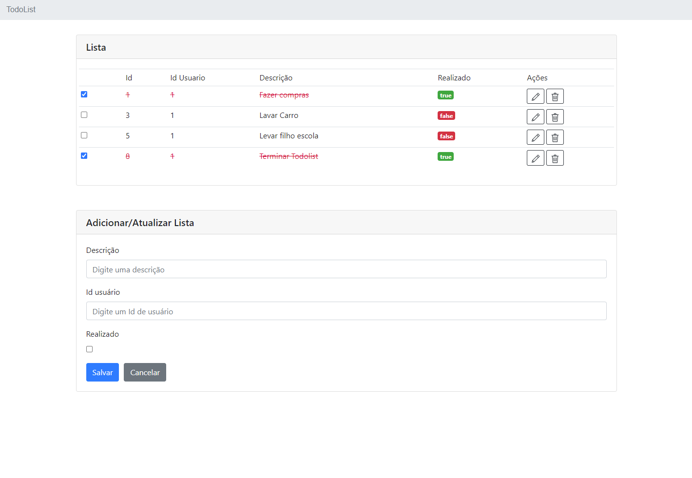
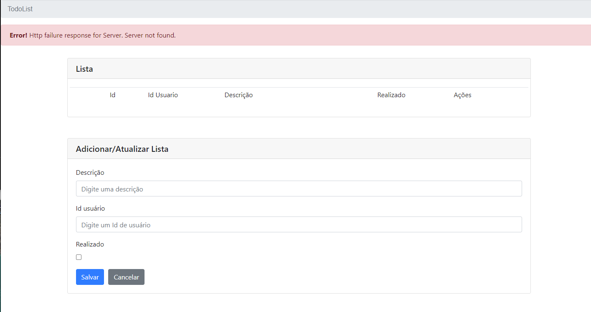

# to-do-list-web

## About

This is a simple APP test. It's a frontend web app. Must be used with by [to-do-list-api](https://github.com/leandrorosendo/to-do-list-api) 


### Build
```
ng build
```

### RUN 
```
copy de build gerate in /dist/my-todolist/ to you web server
```


## How it works

This app is using Angular Framework. It's a very simple app. There is no auth or CSRF protection. APP uses the bootstrap for the layout.

The app is separated in 3 components:

- A parent todolist <app-todolist> with the form. It will check form fields by default. If it is foreced the backend will take care of it.

- A child messaging <app-messaging> tha's only thake care of the Success message and Errors messages.
  
- A service layer responsible for api calls

## Screens


### 1. Form  list


### 2. Errors messages - Add Item Exists


### 3. Errors messages -  Serve PHP off


### 4. Success messages - Add Item 


### 5. Success message - Done Item


### 6. Errors messages -  Form Required


